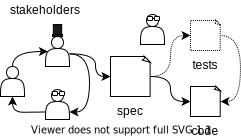
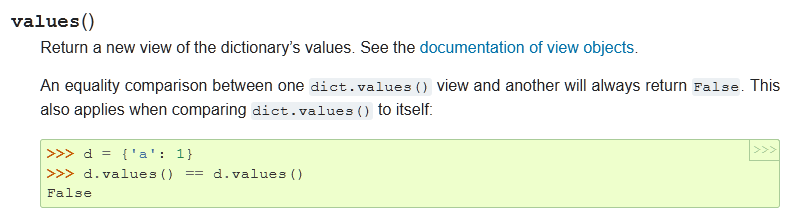
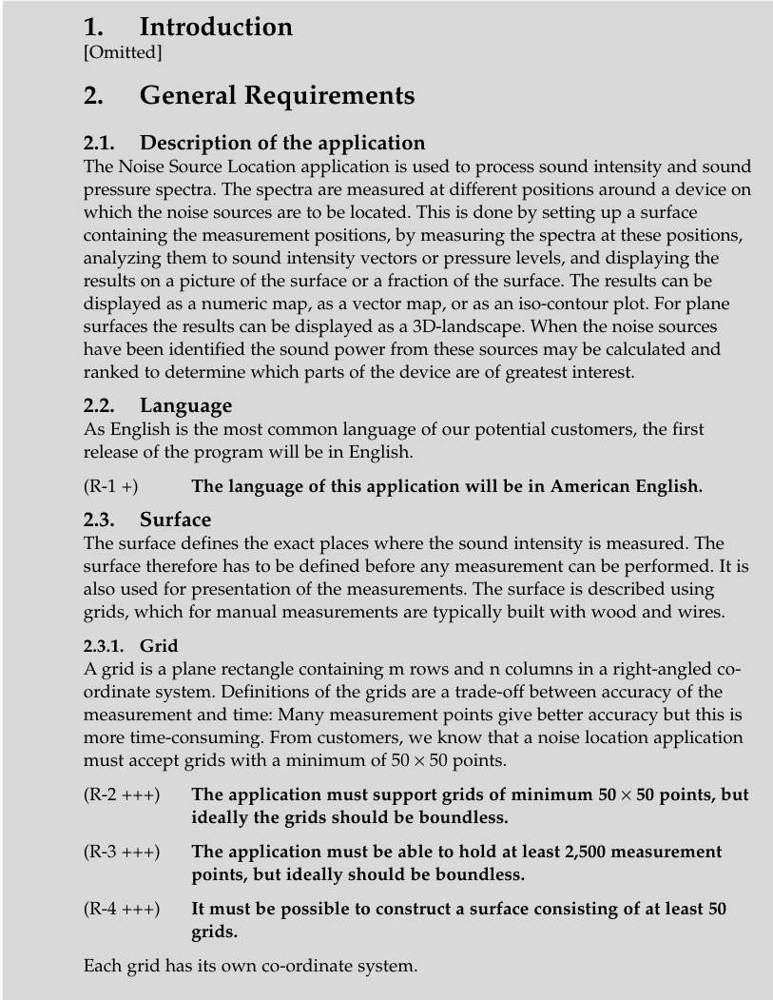

# Software Engineering: Assignement 11

In today’s lecture you were introduced to the topic of software specification.
During your studies the size of the projects you are working on are relatively small, and spending time on specification may seem like
a waste of time.
However, as the complexity of a project grows, the ability to trust other developers code becomes absolutely essential.
Experience shows that if you do not formalise how something should work, it ends up working in strange and unexpected ways.

The concepts of software specification are tightly coupled with testing.
A useful analogy from modern societies is the concept of our judicail system:

- _laws_ -> software specification
- _police_ -> tests that enforces laws.

Using formal languages laws defines how people should behave, whereas the police are the ones actually verifying that people adhere to the laws.
Naturally, if the laws are not enforce, i.e. the code is not tested, the specification is useless.
Likewise, if the laws are too hard to understand, the police will not be able to enforce them effectively.



The grand challenge lies in how to specify software’s behaviour in a way that captures essential properties while remaining useful for all stakeholders involved in a project.
For example the specification should be useful the following people:

- The developer using the requirements to guide implementation of the software.
- The tester translating the requirmement specification into a set of test cases.
- The buisness man that is only intrested in the high level features that the product provides.

There is no _'right'_ way to formalize a software specification.
Rather an appropritate method should be selected based on the particular product being developed.
For example ask youself the following questions:

- Is the safety critical or is it okay if it breaks occasionally? Pacemaker vs website.
- What type of application is being developed? Consider a GUI vs a linear algebra library.

A concrete example is the [python language reference](https://docs.python.org/3/reference/), which is the de-facto specification of the python language:



Another example is a more traditional requirement specification that focuses more on the application level.
A snippet is shown below:



# Exercise

In this exercise you will implement a `Dict` class in C++ based on a requirement specification.
The class allows the insertion and retrival of key value pairs of different types.
For example the dict class can be used to assoicate the name of a person with their age:

```cpp
Dict<string, int> name_to_age;

name_to_age.set("Jane",20);
cout << name_to_age.get("Jane").value() << endl; // prints 20
```

The requirement of the `Dict` class are formalized using the provided header `dict.hpp`:

```cpp
/**
* @brief Associates the key with the specified value.
* If the key is already in the dictionary its value is overwritten.
*
* @param key key associated with the provided key.
* @param val value assoicated with the provided key.
*/
void set(K key, V val)
{
    // put code here
}

/**
* @brief Returns the number of items in the dictionary.
*
* @return the number of items in the dictionary.
*/
size_t len()
{
    return 0;
}
```

This is an example of a ambigious specification.
For example consider, (a) what is the size of the `Dict` before any element is inserted?, (b) how many elements can i store inside the dict?
In cases like these exercise your own good judgement :)

Now, your goal is to:

- Implement the `Dict` class defined in the `dict.hpp` file.
- Implement your own tests in `dict_tests.cpp`, they should
  - check that each function works as defined in the description
  - ensure 100 % coverage of the `Dict` implementation

This is the reverse process of some of the previous exercises, where test cases were provided.
Now it is your turn to convert the requirements into test cases which verifies them.

I suggest the following approach:

1. Examine the `dict.hpp` file, make sure that you understand what each function is supposed to do.
2. For each function implement a test which exercises the function.
3. Implement the method.
4. Run the tests, if they pass continue to the next function, otherwise repeat 2-3.
5. Check that the tests covers all branches of the program. Here you can use: software like `lcov` introduced in class, or if all else fails, print a unique message inside each branch of conditionals.
6. Profit

## Hints

1. Key value pairs can be stored in many ways. A simple way is to store them in two seperate vectors and use the same index for a both the key and value of a pair.
